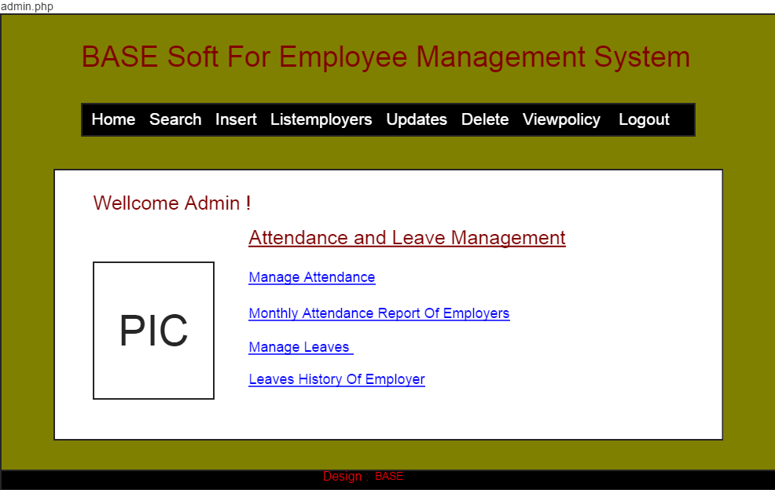
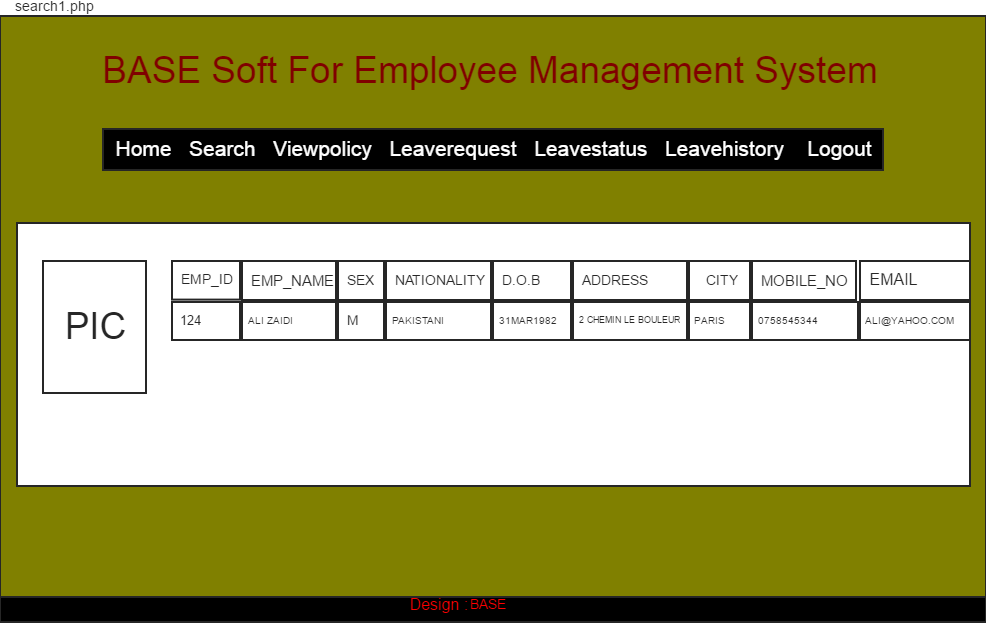
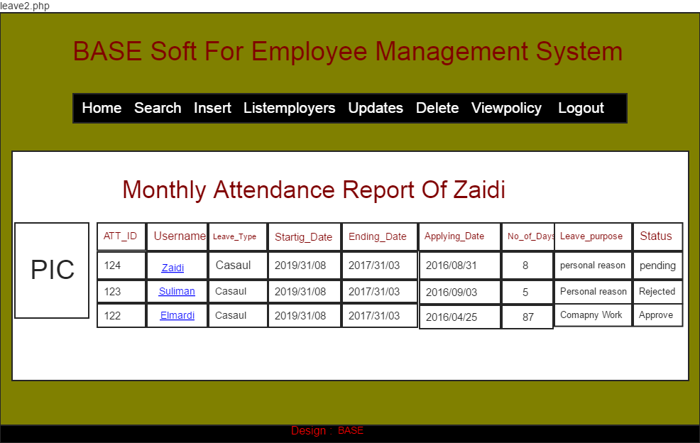
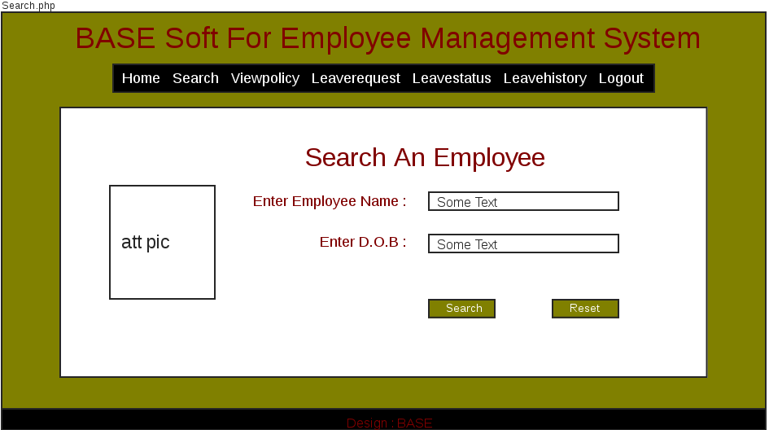
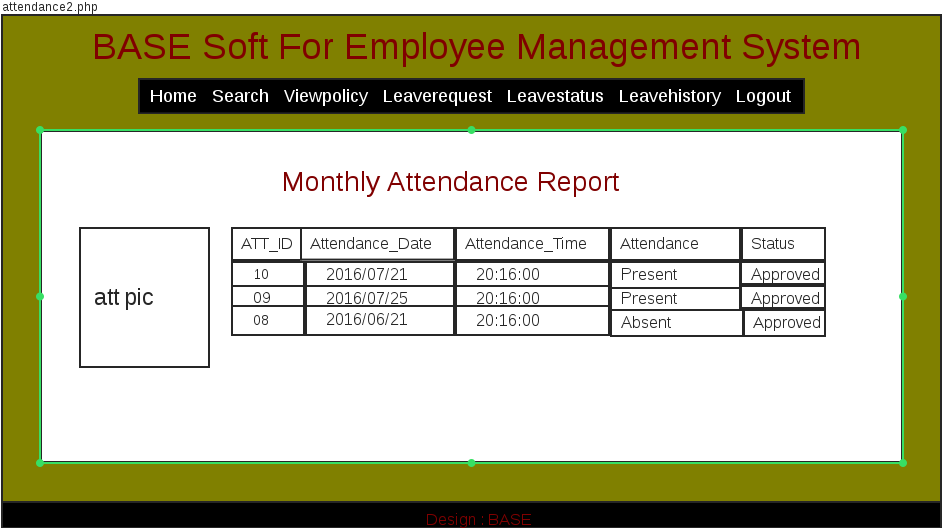
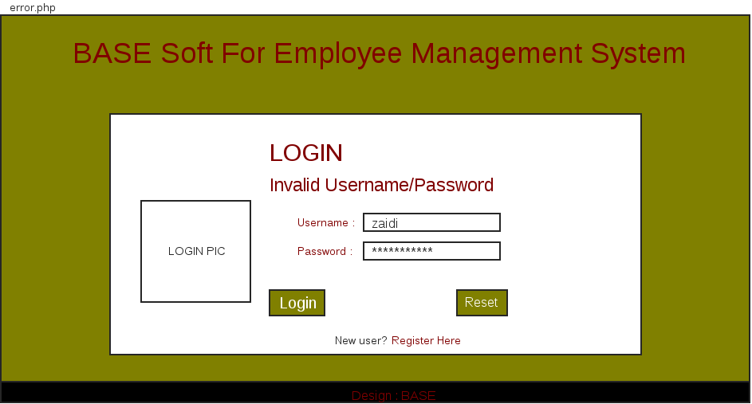
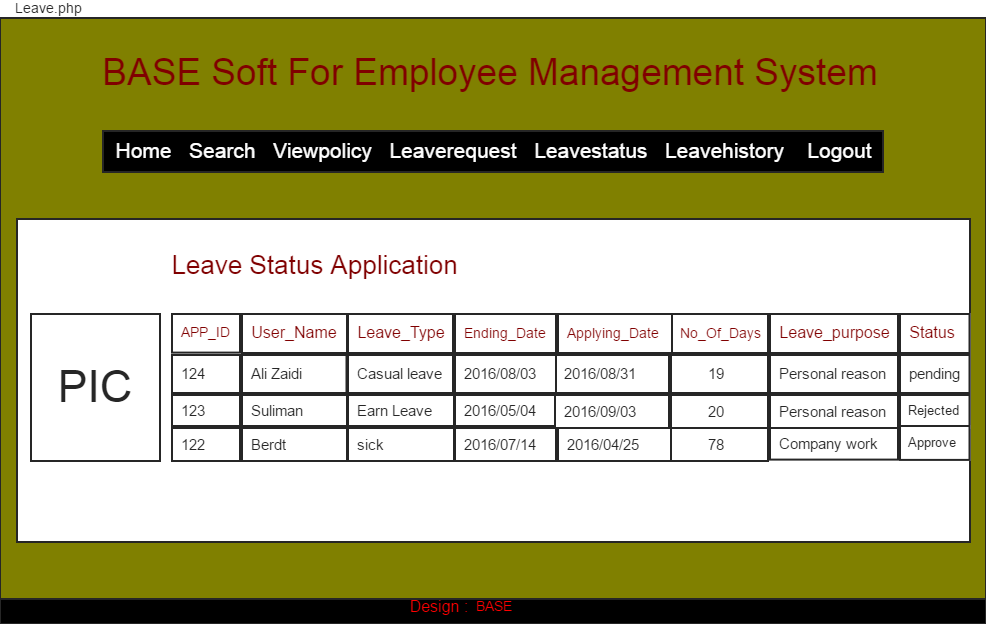
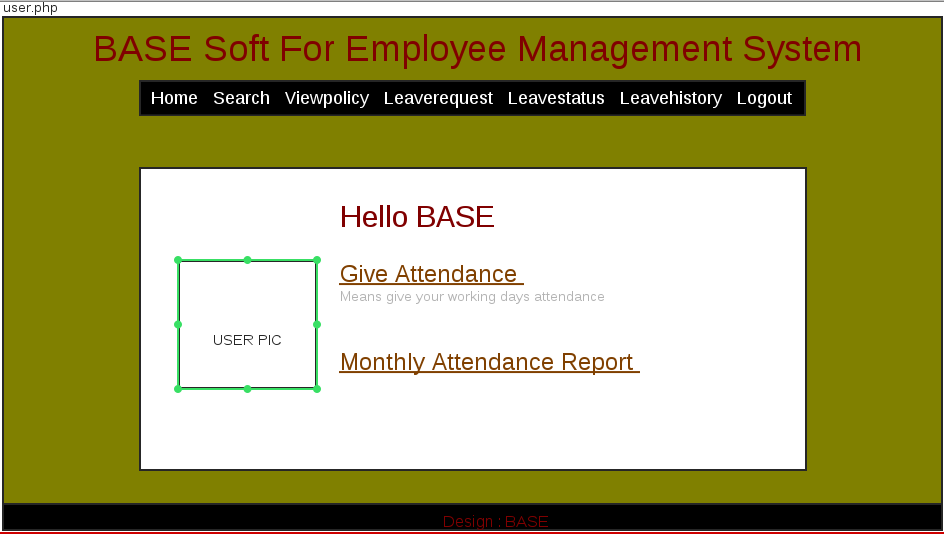
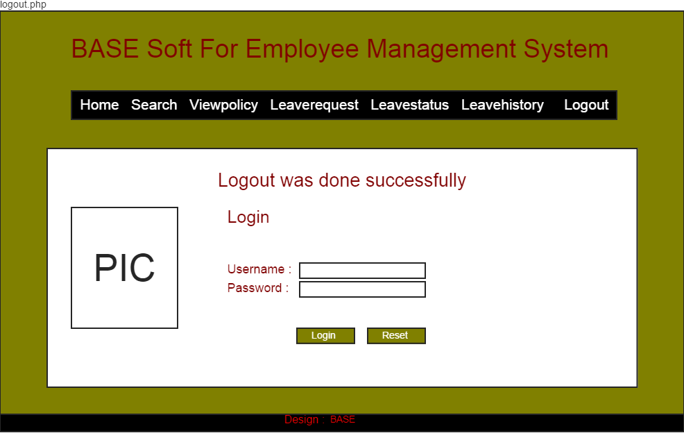
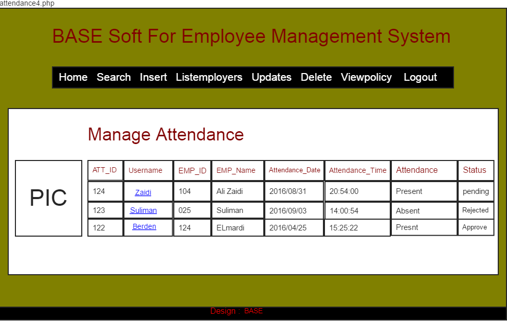

# ATS SPC - Groupe A - Dispositif 1

- Une Application de Gestion des collaborateurs tout les jours ouvrable.
- A pour objetif de contrôler les heures,les dates et les jours ouvrable.
- On a deux types pour utiliser :
  1. Utilisateur
  2. Administrateur qui contrôle la base de données.

## Auteurs

- YAHYA YACOUB Elmardi
- ABDELGADIER Suliman
- SYED ZEESHAN Ali Zaïdi

## Prerequisites

- Create database called `ATS_SPC`:
```sql
CREATE TABLE IF NOT EXISTS `users` (
  `id` int(11) NOT NULL AUTO_INCREMENT,
  `name` varchar(100) COLLATE latin1_bin NOT NULL,
  `surname` varchar(100) COLLATE latin1_bin NOT NULL,
  `email` varchar(200) COLLATE latin1_bin NOT NULL,
  `passcode` varchar(100) COLLATE latin1_bin NOT NULL)
CREATE TABLE IF NOT EXISTS `checkins` (
  `id` int(11) NOT NULL AUTO_INCREMENT,
  `arrival_time` timestamp NOT NULL DEFAULT CURRENT_TIMESTAMP ON UPDATE CURRENT_TIMESTAMP,
  `user_id` int(11) NOT NULL,
  PRIMARY KEY (`id`)
) ENGINE=MyISAM  DEFAULT CHARSET=latin1 COLLATE=latin1_bin AUTO_INCREMENT=28 ;
```
- in the `config.php` file:
```php
define('DB_SERVER', 'localhost'); // Host name
define('DB_USERNAME', 'root'); // Mysql username
define('DB_PASSWORD', 'simplonco');   // Mysql password
define('DB_DATABASE', 'ATS_SPC');  // Database name
```

## Mockups



















